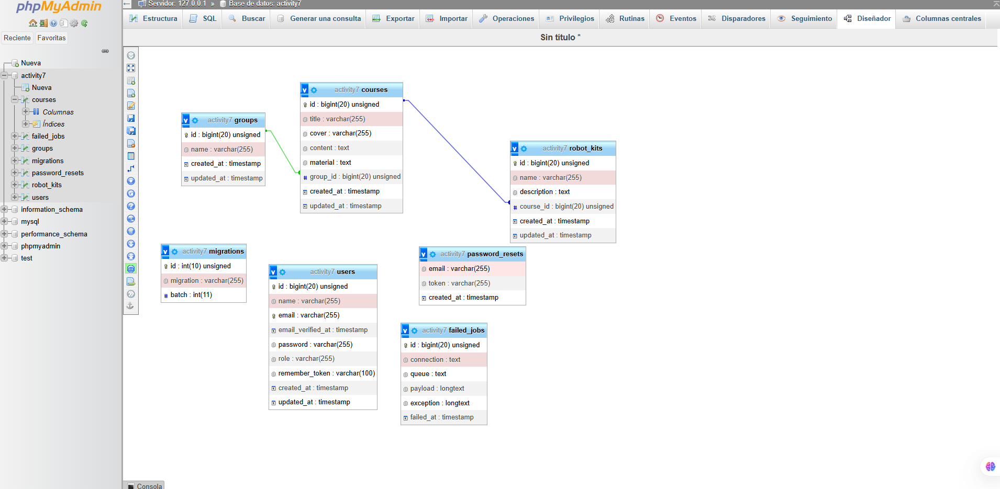

#activity7

Sistema desarrollado en **Laravel 7** para administrar cursos de robótica utilizando **Eloquent ORM**.

## Tecnologías utilizadas

- Laravel 7
- PHP 7.4
- MySQL
- XAMPP
- Faker

## Descripción del proyecto

Este proyecto fue desarrollado como parte de la materia **Diseño de Aplicaciones Web**.

La aplicación permite administrar:

- Usuarios
- Grupos
- Cursos
- Kits de robótica

## Estructura de la base de datos

### Tablas

**groups**

- id
- name
- created_at
- updated_at

**courses**

- id
- title
- cover
- content
- material
- group_id
- created_at
- updated_at

**robot_kits**

- id
- name
- description
- course_id
- created_at
- updated_at

**users**

- id
- name
- email
- password
- group_id
- role
- created_at
- updated_at

## Relaciones

- Un usuario pertenece a un grupo
- Un grupo tiene muchos cursos
- Un curso pertenece a un grupo
- Un curso tiene un robot kit

## Seeders incluidos

- GroupsTableSeeder
- UsersTableSeeder
- CoursesTableSeeder
- RobotKitsTableSeeder

## Datos generados

- 3 grupos
- 3 usuarios
- 100 cursos generados automáticamente
- 3 kits de robótica

## Diagrama ER

## Repositorio

https://github.com/Erick-Barrera-225/activity7